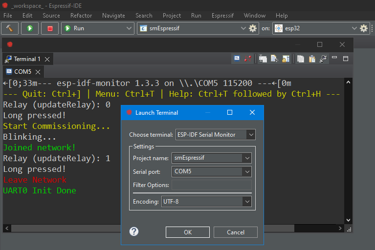
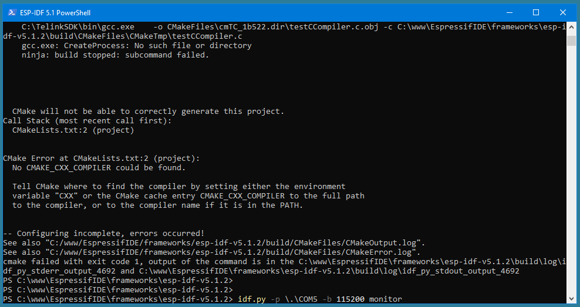
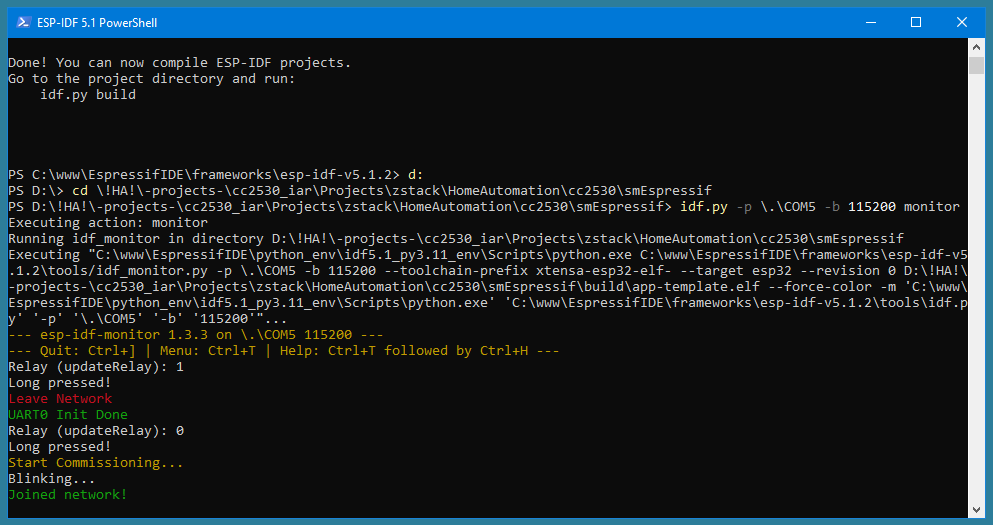

ESP-IDF template app
====================

This is a template application to be used with [Espressif IoT Development Framework](https://github.com/espressif/esp-idf).

Please check [ESP-IDF docs](https://docs.espressif.com/projects/esp-idf/en/latest/get-started/index.html) for getting started instructions.

Using this application template, you can use the ESP-IDF serial monitor inside Espressif IDE  
  
It is also possible to use ESP-IDF PowerShell for this purpose. But in this case, you need to go to the folder with the application. Otherwise, the escape sequences will not be displayed correctly  
  
Here is this version with the correct display of escape sequences  
  
