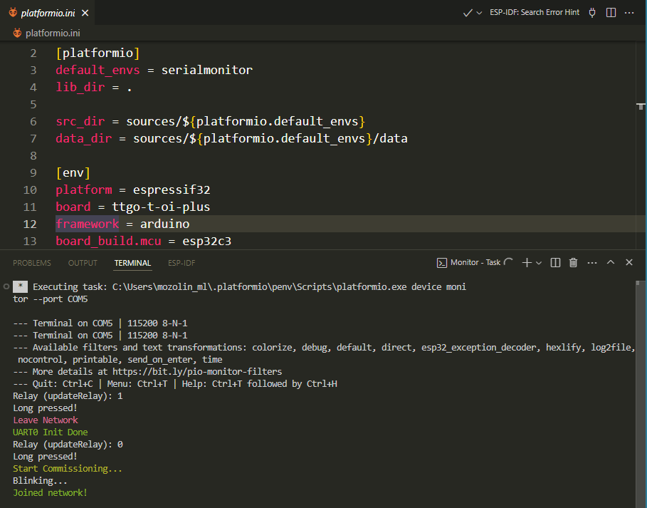
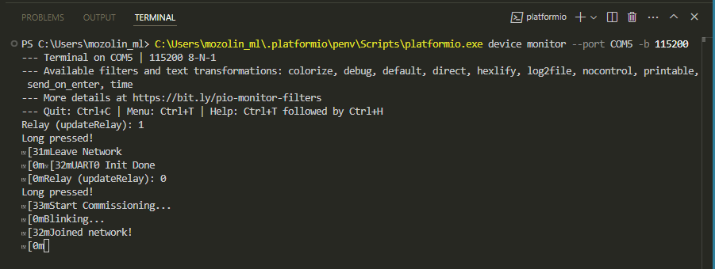
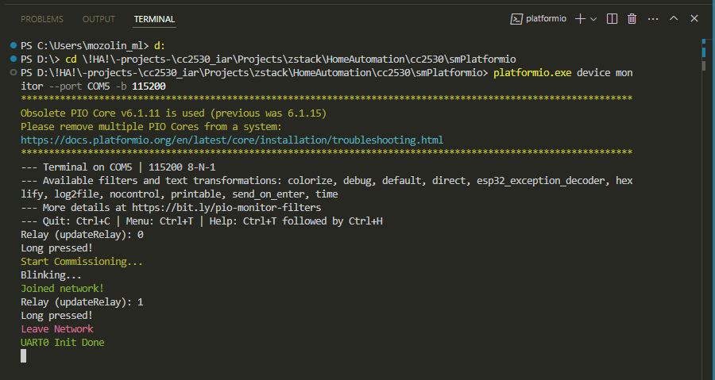
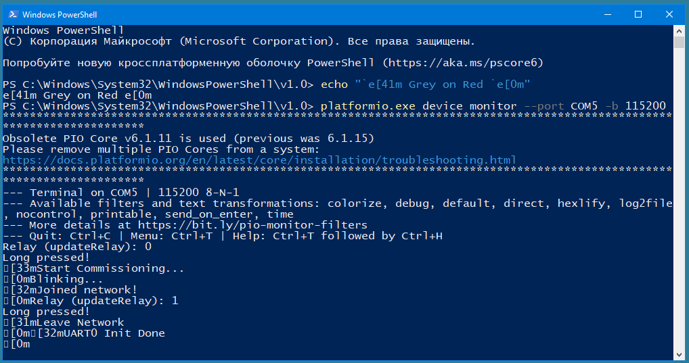
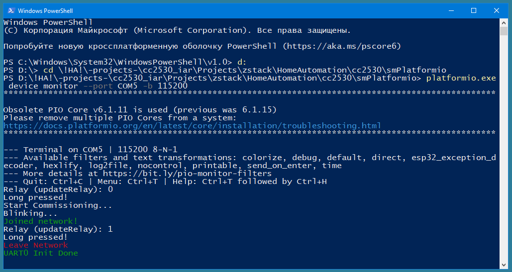
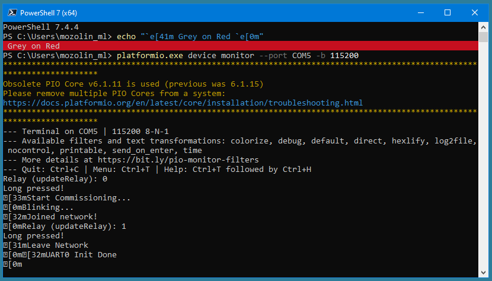
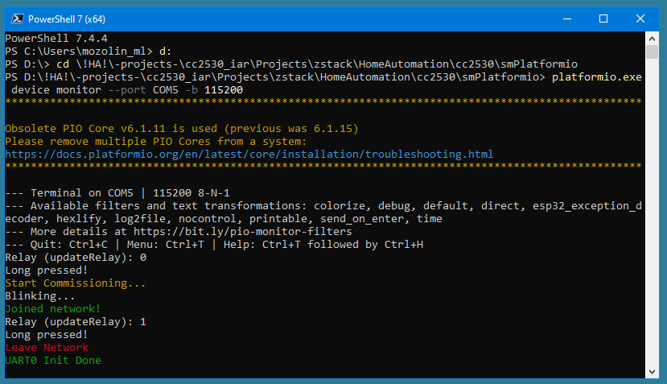

PlatformIO template app
========================

This is a template application to be used with [PlatformIO](https://platformio.org/).

Please check [PlatformIO IDE for VSCode](https://docs.platformio.org/en/latest/integration/ide/vscode.html) for getting started instructions.

Using this application template, you can use the terminal inside PlatformIO IDE  
  
It is also possible to use the PlatformIO terminal for these purposes without creating/opening a project. But in this case, you need to go to the application folder. Otherwise, the escape sequences will not be displayed correctly  
  
Here is this option with the correct display of escape sequences  
  
It is also possible to use Windows PowerShell for these purposes. Here, you also need to go to the application folder. Otherwise, the escape sequences will not be displayed correctly  
  
But even in this case, not all escape sequences will be displayed correctly  
  
The best option is to use PowerShell 7 (x64). Here, you also need to go to the application folder. Otherwise, the escape sequences will not be displayed correctly  
  
Here is this option with the correct display of escape sequences  
  
