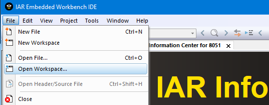
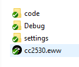
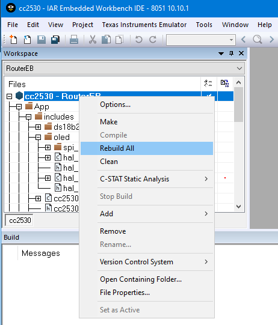
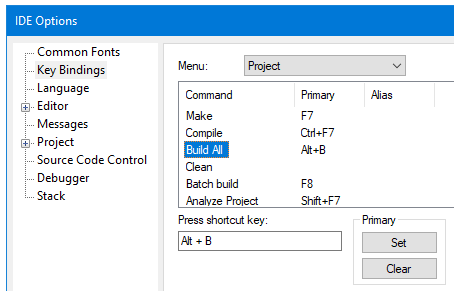
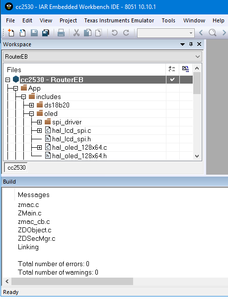
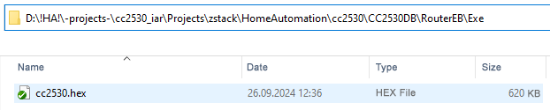
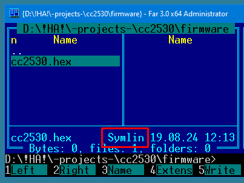
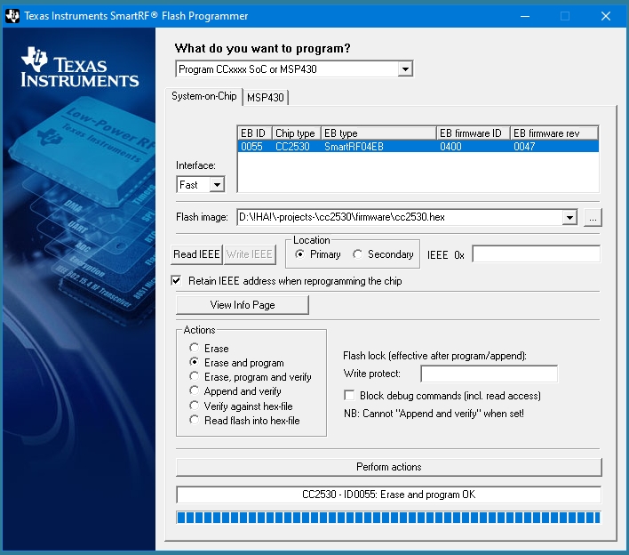

URL: https://github.com/mozolin/CC2530_Z-Stack_IAR-EW  
# Example: Zigbee sensors and modules with CC2530 (Z-Stack + IAR EW 8051)  
Based mainly on the [ZigBee 3.0 Development Guide](https://github.com/mozolin/ZigBee_3.0_Dev_Guide) (Translated by Mike Mozolin using Google Translate)  

1) Open Workspace  

2) Choose Workspace  

3) Rebuild All  

4) Set hot keys  

5) Built  

6) HEX file  

7) Make a symlink  

8) Flash  

